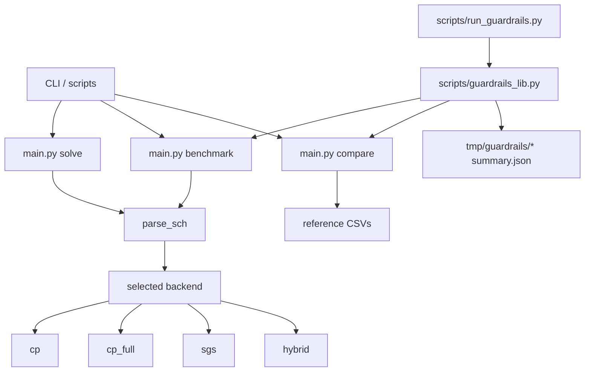
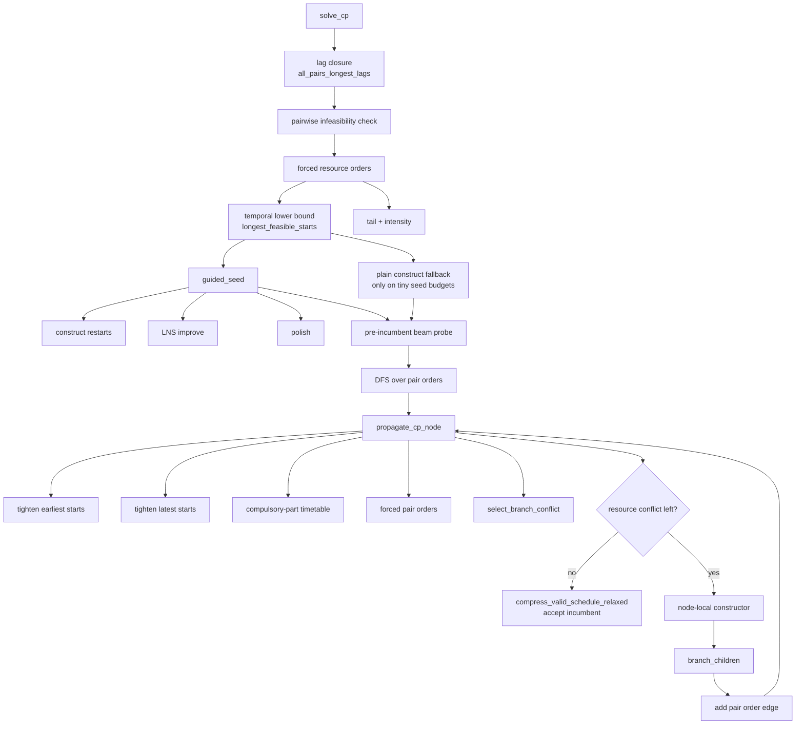

# RCPSP Architecture Review

This note maps the current solver stack, the benchmark harness around it, and the highest-leverage problems that are likely capping performance.

## System Diagram

## CP Solver Diagram

## What The Current Evidence Says

- Focused correctness checks passed:
  - `uv run python -m pytest tests/test_cp_search.py tests/test_cp_propagation.py tests/test_guardrails_lib.py tests/test_runtime_limits.py tests/test_branching_regressions.py`
- On `sm_j30/PSP37.SCH @ 1.0s`, the biggest cumulative costs were not deep search alone:
  - `select_branch_conflict`: about `0.305s`
  - `construct_schedule`: about `0.336s`
  - `longest_feasible_starts`: about `0.242s`
  - `all_pairs_longest_lags`: about `0.141s`
  - `build_resource_profile`: about `0.120s`
- On `uv run python scripts/run_cp_residue.py --time-limit 5.0`, CP now solves `3/4` residue cases after the new pre-incumbent probe:
  - `guided_seed_failed_cases = 4`
  - `no_incumbent_before_dfs_cases = 2`
  - `heuristic_construct_failures = 0`
  - `node_local_construct_failures = 68`
  - `propagation_pruned_nodes = 14037`
- The current tree has already removed one architectural waste in this path:
  - `guided_seed` no longer spends its seed budget on a duplicate exact-proof phase
  - `solve_cp` now reuses the root preprocessing inside `guided_seed` instead of recomputing it there
- The current tree also now includes a bounded pre-incumbent beam between `guided_seed` and the main DFS:
  - it reuses the propagated root node
  - it probes shallow CP children with a larger local incumbent budget before the full DFS commits
  - on `PSP37` and `PSP46`, that was enough to stop entering DFS empty-handed

## Highest-Leverage Holes

### 1. Incumbent generation is still too weak on hard feasible cases

The biggest structural waste in the old seed path was removed:

- `guided_seed` now acts as an incumbent builder only
- the old duplicate exact-proof seed phase is gone
- `solve_cp` now hands precomputed root state into `guided_seed`

The recent probe change improved this materially, but the deeper issue is not fully gone: hard cases can still reach DFS with no incumbent at all.

Relevant code:

- [rcpsp/cp/search.py](/Users/weisintai/development/smu/modules/y2s2/cs202/project/rcpsp/cp/search.py#L562)
- [rcpsp/cp/guided_seed.py](/Users/weisintai/development/smu/modules/y2s2/cs202/project/rcpsp/cp/guided_seed.py#L309)
- [rcpsp/cp/search.py](/Users/weisintai/development/smu/modules/y2s2/cs202/project/rcpsp/cp/search.py#L635)

What changed:

- `search.py` now runs a bounded pre-incumbent beam if `guided_seed` still fails
- that beam reuses root propagation instead of paying for it twice
- it improved the `5.0s` residue slice from `1 feasible / 3 unknown` to `3 feasible / 1 unknown`

Why this still matters:

- the residue run shows the solver often enters DFS with no incumbent at all
- that means pruning is weak exactly on the cases where stronger bounds matter most

High-value direction:

- borrow a tiny `sgs`-style micro warm-start before the heavier CP seed path
- give `guided_seed` a cheaper first-feasible mode instead of relying only on the current constructor
- add a very cheap incumbent polish step that runs only after the first feasible schedule exists

### 2. Too much work is spent rebuilding full temporal and resource views

Large parts of the stack repeatedly recompute whole-instance structures:

- `construct_schedule` scores candidate orderings by re-running `longest_feasible_starts`
- repair does another `longest_feasible_starts` before calling back into construction
- propagation rebuilds full mandatory profiles over the horizon
- branch conflict selection rebuilds the full resource profile

Relevant code:

- [rcpsp/cp/construct.py](/Users/weisintai/development/smu/modules/y2s2/cs202/project/rcpsp/cp/construct.py#L148)
- [rcpsp/cp/construct.py](/Users/weisintai/development/smu/modules/y2s2/cs202/project/rcpsp/cp/construct.py#L203)
- [rcpsp/cp/improve.py](/Users/weisintai/development/smu/modules/y2s2/cs202/project/rcpsp/cp/improve.py#L321)
- [rcpsp/cp/propagation.py](/Users/weisintai/development/smu/modules/y2s2/cs202/project/rcpsp/cp/propagation.py#L127)
- [rcpsp/core/conflicts.py](/Users/weisintai/development/smu/modules/y2s2/cs202/project/rcpsp/core/conflicts.py#L69)
- [rcpsp/temporal.py](/Users/weisintai/development/smu/modules/y2s2/cs202/project/rcpsp/temporal.py#L12)

Why this matters:

- the profile already shows a large share of time in these rebuilds
- if each node is expensive, better branching heuristics will still hit the same wall

High-value direction:

- keep incremental resource profiles or at least per-node cached profile/conflict summaries
- avoid full `longest_feasible_starts` calls when evaluating single new pair orders
- treat temporal closure as a maintained state object, not something reconstructed in every constructor branch

### 3. The CP LNS neighborhood is likely too frozen

`repair_schedule_subset` pins all observed `resource_order_edges` among non-removed jobs, but `resource_order_edges` preserves order for any pair that merely shares a resource. On cumulative resources, that is much stricter than necessary.

Relevant code:

- [rcpsp/cp/improve.py](/Users/weisintai/development/smu/modules/y2s2/cs202/project/rcpsp/cp/improve.py#L321)
- [rcpsp/core/compress.py](/Users/weisintai/development/smu/modules/y2s2/cs202/project/rcpsp/core/compress.py#L80)
- [rcpsp/core/compress.py](/Users/weisintai/development/smu/modules/y2s2/cs202/project/rcpsp/core/compress.py#L101)

Why this matters:

- the improver may be exploring only tiny perturbations around the incumbent
- that suppresses incumbent quality, which then suppresses search pruning

High-value direction:

- pin only disjunctive pairs, not all shared-resource pairs
- or pin only hotspot-local edges plus precedence-critical edges
- add a second repair mode that deliberately drops more cumulative-resource order baggage

### 4. Propagation cost control exists in `cp_full`, but it is not the main bottleneck by itself

The main `cp` backend always pays for the heavier propagation path: compulsory-part profiles and forced-pair scans. `cp_full` adds an explicit propagation mode split and instance-aware heuristic budgeting.

Relevant code:

- [rcpsp/cp/search.py](/Users/weisintai/development/smu/modules/y2s2/cs202/project/rcpsp/cp/search.py#L562)
- [rcpsp/cp/propagation.py](/Users/weisintai/development/smu/modules/y2s2/cs202/project/rcpsp/cp/propagation.py#L219)
- [rcpsp/cp/propagation.py](/Users/weisintai/development/smu/modules/y2s2/cs202/project/rcpsp/cp/propagation.py#L306)
- [rcpsp/cp_full/search.py](/Users/weisintai/development/smu/modules/y2s2/cs202/project/rcpsp/cp_full/search.py#L123)
- [rcpsp/cp_full/propagation.py](/Users/weisintai/development/smu/modules/y2s2/cs202/project/rcpsp/cp_full/propagation.py#L94)
- [rcpsp/cp_full/propagation.py](/Users/weisintai/development/smu/modules/y2s2/cs202/project/rcpsp/cp_full/propagation.py#L492)

Why this matters:

- it is still a real cost problem
- but the residue comparison suggests it does not materially fix solution quality on its own

High-value direction:

- keep the propagation-mode split as a cost optimization
- do not treat it as the main quality unlock
- pair it with a better incumbent pipeline, otherwise it mostly just changes nodes-per-second

### 5. CP is missing a few cheap incumbent-building ideas that already exist elsewhere in the repo

Transferable ideas from `sgs` and the older `heuristic` stack:

- tiny warm-start budget before the main search:
  - [rcpsp/sgs/warm_start.py](/Users/weisintai/development/smu/modules/y2s2/cs202/project/rcpsp/sgs/warm_start.py#L14)
- cheap forward/backward polish after a feasible schedule:
  - [rcpsp/sgs/fbi.py](/Users/weisintai/development/smu/modules/y2s2/cs202/project/rcpsp/sgs/fbi.py#L75)
- adaptive operator weighting in local improvement:
  - [rcpsp/heuristic/improve.py](/Users/weisintai/development/smu/modules/y2s2/cs202/project/rcpsp/heuristic/improve.py#L34)

These are not cosmetic. They directly target the incumbent starvation pattern seen in the residue run.

## Harness Problems That Can Still Mislead Tuning

The current `guardrails + compare` harness is good enough for day-to-day iteration, but it still has blind spots.

### 1. Missing reference rows are counted but not treated as evaluation failures

- compare keeps going on missing references:
  - [main.py](/Users/weisintai/development/smu/modules/y2s2/cs202/project/main.py#L344)

### 2. Everything is effectively tuned against one deterministic seed stream

- benchmark seeds are `args.seed + index - 1`:
  - [main.py](/Users/weisintai/development/smu/modules/y2s2/cs202/project/main.py#L239)
- guardrails pass one seed through the whole run:
  - [scripts/guardrails_lib.py](/Users/weisintai/development/smu/modules/y2s2/cs202/project/scripts/guardrails_lib.py#L218)

This is fine for reproducibility, but weak for judging whether a change is genuinely stronger instead of just luckier.

## Recommended Priority Order

If the goal is a non-marginal jump, the order I would attack is:

1. Fix incumbent starvation first.
   - unify or simplify the `guided_seed` and main DFS pipeline
   - spend early budget on getting a feasible incumbent, not on duplicate proof work
   - add a tiny cheap warm-start plus cheap FBI-style polish
2. Shrink node cost second.
   - eliminate repeated full profile and temporal recomputation on candidate moves
   - cache branch-conflict/resource-profile data at the node level
3. Widen the CP improvement neighborhood.
   - stop pinning all shared-resource order edges
   - import adaptive operator weighting from `heuristic/improve.py`
4. Tighten the harness before more tuning.
   - require exact preset/dataset match when comparing baselines
   - fail on missing references
   - add multi-seed summary reporting

## Bottom Line

The repo does not look blocked by one bad weight or one weak branching heuristic. The stronger story is:

- CP often fails to get an incumbent on hard cases
- large chunks of time are spent rebuilding whole-instance state
- the local improver is likely overconstrained
- the evaluation harness can overstate progress on narrow runs

That combination is consistent with a solver that has already been tuned hard at the surface level and now needs a more structural change.
